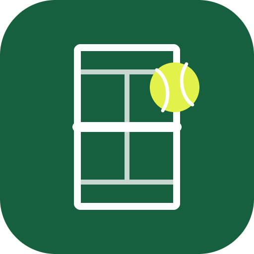
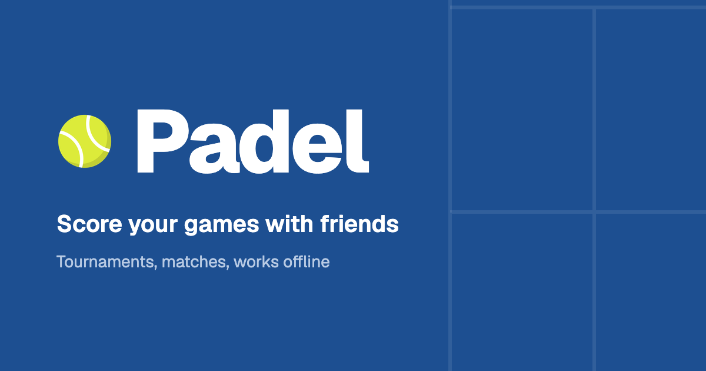

<p align="center">
  
</p>

<h1 align="center">Padel</h1>

<p align="center">
  Americano tournaments and matches with your friends.<br />
  Scored courtside on your phone. Works offline.
</p>

<p align="center">
  
</p>

---

Padel is a small web app for casual padel, used from your phone between games. It installs to your home screen, needs
no account, and keeps everything on your phone, so it works with no connection at all.

## What you can play

- **Americano.** A tournament for 4 or more players on any number of courts. Partners rotate every round, each player
  scores the points their team wins, and the app makes the whole schedule up front with fair sit-outs. Play to any
  target from 8 to 32, as total points or first to.
- **Match.** Two pairs, scored point by point into games and sets. Best of 1, 3 or 5 sets, a tie-break when the games
  are level, advantage or golden point at 40–40, and undo for a mis-tap.

## Also

- Live standings for a tournament; set-by-set stats for a match.
- A results image to share on WhatsApp or save when the game ends.
- Play again with the same people and settings in one tap.
- Saved after every score or point. Lock the phone or close the tab and nothing is lost.
- A history of past games, filtered by kind.

## How Americano standings work

Each player's score is the total of the points their teams won. The player with the most points is first.

### When players are level on points

Ties are broken in this order. Each step is only used if the one before it leaves players level.

**1. Point difference.** Points scored minus points conceded, shown in the **+/−** column.

First to 16, three games each:

| Player | Scored | Conceded | +/− | Place |
| --- | --- | --- | --- | --- |
| Ana | 40 | 30 | +10 | 1 |
| Ben | 40 | 36 | +4 | 2 |

This step only matters in first-to games. In total-points games every game adds up to the same number, so two players
level on points are always level on difference too.

**2. Head-to-head.** Only the players still level are compared, and only the games where they stood on opposite sides of
the net. A player gets +1 for each of those games won and −1 for each lost. Games they played as partners don't count.

Ana, Ben and Cai are level on points and difference:

| Game between them | Winner |
| --- | --- |
| Ana's team v Ben's team | Ana |
| Ana's team v Cai's team | Ana |
| Ben's team v Cai's team | Ben |

Ana is +2, Ben is 0 (one won, one lost) and Cai is −2, so they finish in that order.

**3. Wins.** If head-to-head is level too (say Ana and Ben never faced each other, or won one each), the player who won
more games in the whole tournament goes higher.

**Still level?** The players share the place, and the next place is skipped: 1, 2, 2, 4. Players who share first place
all win the tournament.

### When players have played a different number of games

If the players don't fill the courts exactly, somebody sits out each round. Sit-outs are shared so nobody falls more
than one game behind, but a tournament can still end with some players a game short.

In the **final** standings, a player who played fewer games than the most anyone played has their points scaled up, as
if they had kept scoring at the same rate:

> points × most games played ÷ games played

| Player | Games | Points scored | Final points |
| --- | --- | --- | --- |
| Ana | 5 | 14 | 14 |
| Ben | 4 | 12 | 12 × 5 ÷ 4 = **15** |

Ben finishes above Ana. His point difference is scaled the same way, so +4 from four games counts as +5.

The result is not always a whole number: 13 points from 3 games, when others played 4, is 17.33, shown as 17.3.

Nothing is scaled while the tournament is still going. A player with fewer games then may just not have played their
next one yet.

## Install

- **Chrome or Edge** (Android, Windows, Mac): tap **Install** on the home screen.
- **iPhone or iPad:** in Safari, tap Share, then **Add to Home Screen**.

## Running it locally

You need Node.js 20.19 or newer.

```bash
npm install
npm run dev        # start the dev server
npm test           # run the tests
npm run build      # build for production into dist/
npm run preview    # serve the build (needed to try offline mode and installing)
```

Built with React, Vite, TypeScript, Tailwind CSS and shadcn/ui. The rules live in plain functions in
[`src/lib/`](src/lib/), each with a test file whose test names read as the rules themselves.

## Deploying

It is a static site; any static host works. It is set up for Cloudflare Pages:

| Setting | Value |
| --- | --- |
| Build command | `npm run build` |
| Build output directory | `dist` |
| Environment variable | `VITE_SITE_URL` = the site's address, no trailing slash |

Node is pinned in [`.node-version`](.node-version) and response headers live in
[`public/_headers`](public/_headers). Do not add a `404.html`: without one, Pages serves the app for every
address, which is how `/privacy` and `/terms` open and how the app shows its own 404 screen for anything else.

## License

Free and open source under the [MIT License](LICENSE).
